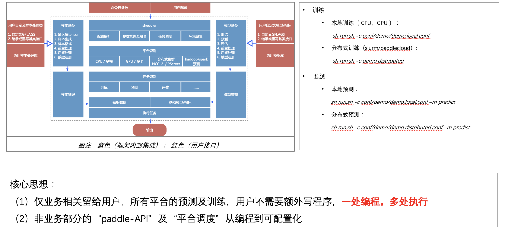
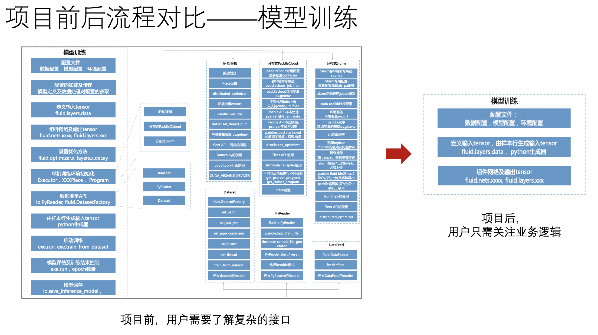
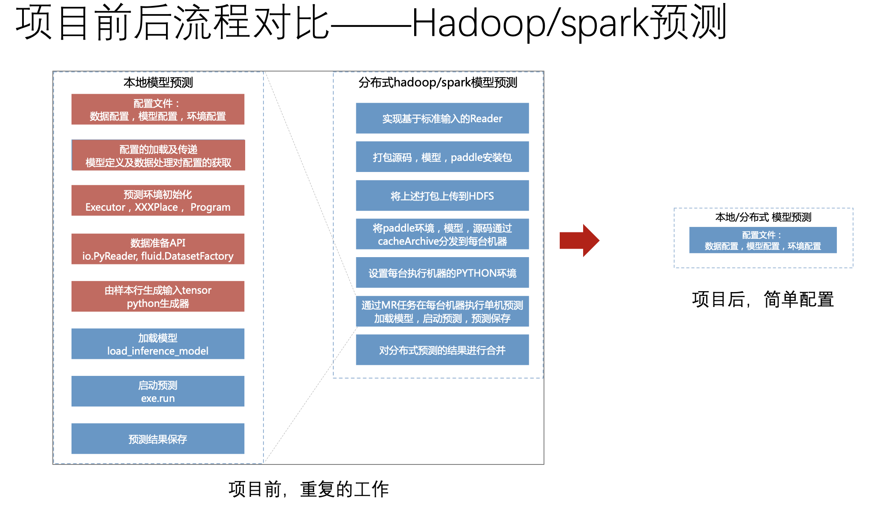

# Easy Paddle, Effective Paddle

[](https://github.com/PaddlePaddle/epep) [](LICENSE)

**EPEP** is an Application Framework for PaddlePaddle, to make everyone can easily learn and use. 目前已经被广泛应用在百度内部业务，显著提升单机CPU, 单机GPU, 多机多卡的模型迭代效率


## 目录
* [环境搭建](#环境搭建)
* [框架说明](#框架说明)
* [使用说明](#使用说明)

## 环境搭建

1. Linux CentOS 6.3, Python 2.7, 获取PaddlePaddle v1.6.1版本以上, 请参考[安装指南](http://www.paddlepaddle.org/#quick-start)进行安装

2. 配置修改conf/var_sys.conf
```
fluid_bin=/home/epep/tools/paddle_release_home/python/bin/python

#gpu训练配置
cuda_lib_path=/home/epep/tools/cuda-9.0/lib64:/home/epep/tools/cudnn/cudnn_v7.3/cuda/lib64:/home/epep/tools/nccl-2.2_cuda-8.0/lib:$LD_LIBRARY_PATH
```

## 框架说明

### 整体框架






## 使用说明

框架提供了一些NLP的例子，主要包括分类，回归，匹配，标注，翻译，生成等

这里以LR为例，用户只要写20行相关代码即可完成，全是业务模型相关，通过epep轻松一键CPU->GPU, GPU多卡，多机多卡(TODO with Easy-DL)

1. 定义输入

```python
class LinearRegression(BaseDataset):
    def __init__(self, flags):
        super(LinearRegression, self).__init__(flags)
    
    #输入的定义
    def parse_context(self, inputs):
        """
        set inputs_kv: please set key as the same as layer.data.name
        notice:
        (1)
        If user defined "inputs key" is different from layer.data.name,
        the frame will rewrite "inputs key" with layer.data.name
        (2)
        The param "inputs" will be passed to user defined nets class through
        the nets class interface function : net(self, FLAGS, inputs), 
        """
        inputs['x'] = fluid.layers.data(name="x", shape=[self._flags.input_size], dtype="float32")
        inputs['y'] = fluid.layers.data(name="y", shape=[1], dtype="float32")

        context = {"inputs": inputs}
        #set debug list, print info during training
        #debug_list = [key for key in inputs]
        return context

    #解析一行转成parse_context要求的格式, 框架组batch
    def parse_oneline(self, line):
        cols = line.strip("\t\n").split("\t")
        #input_size is size of vector X, 1 is label.
        label = [0]
        if len(cols) >= self._flags.input_size + 1:
            label = [float(cols[self._flags.input_size])]
        input_list = [float(x) for x in cols[:self._flags.input_size]]
        yield ("x", input_list),\
              ("y", label)
    
    #也可以自己组batch, 配置reader_batch设置True
    def parse_batch(self, data_gen):
        for d in data_gen():
            d = self.parse_oneline(d)
            ....
```

2. 组网

```python
class LinearRegression(BaseNet):
    def __init__(self, FLAGS):
        super(LinearRegression, self).__init__(FLAGS)

    def net(self, inputs):
        """
        linear regression interface
        """
        y_predict = fluid.layers.fc(input=inputs["x"], size=1, act=None)
        cost = fluid.layers.square_error_cost(input=y_predict, label=inputs["y"]) 
        avg_cost = fluid.layers.mean(cost)
        
        # debug output info during training
        debug_output = collections.OrderedDict()
        debug_output['y'] = inputs["y"]
        debug_output['y_predict'] = y_predict
        
        #下面几个字段必须，框架依赖
        model_output = {}
        net_output = {"debug_output": debug_output, 
                      "model_output": model_output}
        
        if self.is_training:
            #默认是Adam，如果要自定义optimizer
            #optimizer = fluid.optimizer.SGD(learning_rate=self._flags.base_lr)
            #net_output['optimizer'] = optimizer

            net_output["loss"] = avg_cost

        #预测使用
        model_output['feeded_var_names'] = ["x"]
        model_output['fetch_targets'] = [y_predict]

        return net_output


    #还可根据需要自定义下面3个函数
    
    #训练打印的日志
    def train_format(self, result, global_step, epoch_id, batch_id):
    
    #从第三方的模型参数加载初始化一些变量
    def init_params(self, place):
    
    #预测的输出格式
    def pred_format(self, result, **kwargs):
```

3. 配置&运行

```
#基本配置
#如果模型需要自定义参数，只需要在配置文件直接加xxx就行，不需要代码里提前定义xxx, 就可以引用self._flags.xxxx
[DEFAULT]
dataset_name: LinearRegression
#file_list prior to dataset_dir
file_list: ./test/linear_regression.data
dataset_dir: ../tmp/data/lr
#only read file match pattern in dataset_dir
file_pattern: part-
#Model settings
model_name: LinearRegression
```

### 训练

```
[Train]
base_lr: 0.01
max_number_of_steps: None
#Number of epochs from dataset source
num_epochs_input: 100
#The frequency with which logs are print
log_every_n_steps: 10
#The frequency with which the model is saved, in steps.
save_model_steps: 100

#默认是CPU，如果要GPU, 确保conv/var_sys.conf的cuda_lib_path配置
platform: local-gpu

#单卡或多卡
CUDA_VISIBLE_DEVICES: 0,1

sh run.sh -c conf/linear_regression/linear_regression.local.conf [-m train]

```

### 预测

```
[Evaluate]

#for predict, init_pretrain_model prior to eval_dir, and can change the net by train saved
#init_pretrain_model: ../tmp/model/lr/save_model/checkpoint_final
#默认是CPU，如果要GPU, 确保conv/var_sys.conf的cuda_lib_path配置
platform: local-gpu

#单卡就行
CUDA_VISIBLE_DEVICES: 0

sh run.sh -c conf/linear_regression/linear_regression.local.conf -m predict

```

### 边训练边评估
TODO

4. 总结

用户只要关注3个：conf/xxx/xxx.local.conf, datasets/xxx.py, nets/xxx.py, 保证路径位置是这样即可

新模型开发比较快的就是 cp这lr的3个文件到对应位置，然后重命名下再去修改对应的配置和代码即可。

## Contributing|贡献

本项目目标是让策略开发高效，愉快的做一个炼丹师，欢迎贡献！

## TODO
1. Rank, NMT, ERNIE, 分类，匹配，序列标注，Attention，视觉等AI先进模型

2. 自动超参数搜索

3. 预测server

4. 分布式Easy-DL, Hadoop/Spark预测

5. ...
